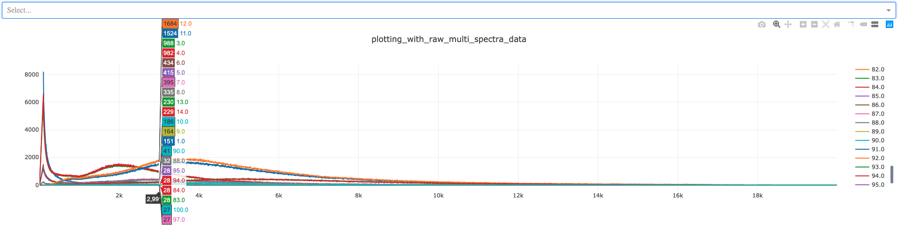

# pandas_vs_numpy

## Desired Plotting format for line and scatter visualisations

This document details the differences between visualising data using 
Numpy array and Pandas dataframe data structures. 

If you wish to run locally, please install any required dependencies:

1) [Numpy](https://pypi.org/project/numpy/) - pip install numpy
2) [Pandas](https://pypi.org/project/pandas/) - pip install pandas
3) [Dash](https://pypi.org/project/dash/) - pip install dash

Running locally will display two visualisations which can also be seen in the image below:


The top line plot is GEM spectrum data while the second line plot is of randomly generate data. 

When plotting data using Pandas dataframes, no additional modifications are requered. Optionally 
for readability, you can add labels to call columns by name as to numerical index.

Plotting using Numpy arrays requires the data to be transposed to rotate the data in order to 
visualise due to how Numpy arrays are read. You are unable to add labels to these arrays meaning they are less readable. A requirment to understand the data would be needed if Numpy arrays are used.

A possible solution to this would be to place each sub-array inside the numpy array inside a 
dictionary to use the key as a labels for reference.

## Running plotting_multi_spectra_data.py

This script is stored inside the plotting_format_example directory

The dataframe containing raw data follows the below structure:

```
|Spectrum | X      | Y   | E  |
| :---    | :---: |:---:| ---:|
| 1.0     |       |     |     |
| 1.0     | 1     | 2   | 3   |
| 1.0     | 4     | 5   | 6   |
| 2.0     | 1     | 2   | 3   |
| 2.0     | 4     | 5   | 6   |
```

Please note that this script takes some time to run due to the large size of the raw data being 
plotted. 

Only when you receive an output in your terminal similar to below is the visualisation ready. 

```
Running on http://127.0.0.1:8050/
Debugger PIN: 880-009-103
 * Serving Flask app "plotting_with_raw_multi_spectra_data" (lazy loading)
 * Environment: production
   WARNING: This is a development server. Do not use it in a production deployment.
   Use a production WSGI server instead.
 * Debug mode: on
Running on http://127.0.0.1:8050/
Debugger PIN: 477-245-086
```

The output in the web-page should look similar to this:

